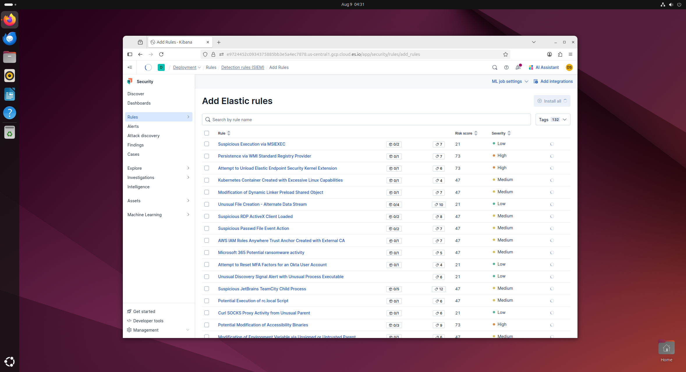
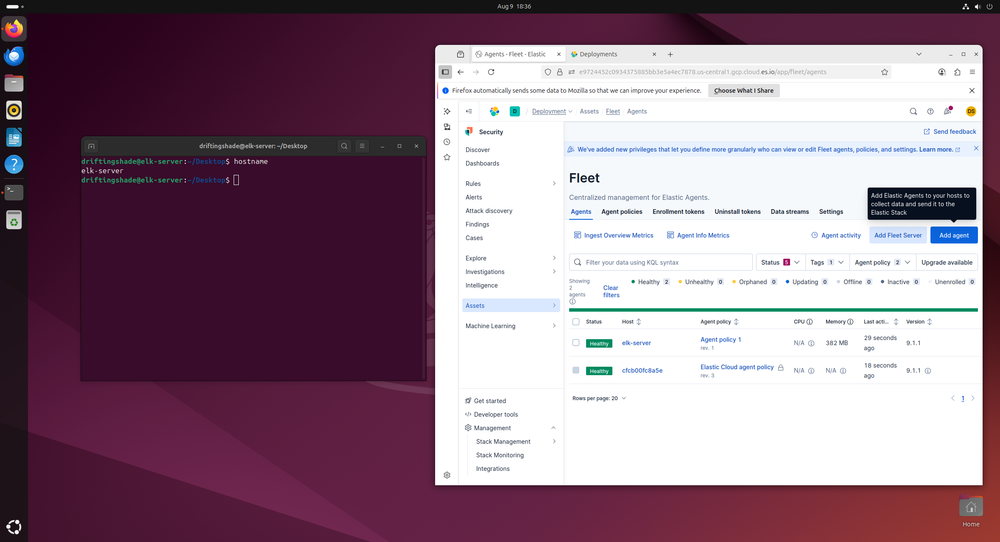
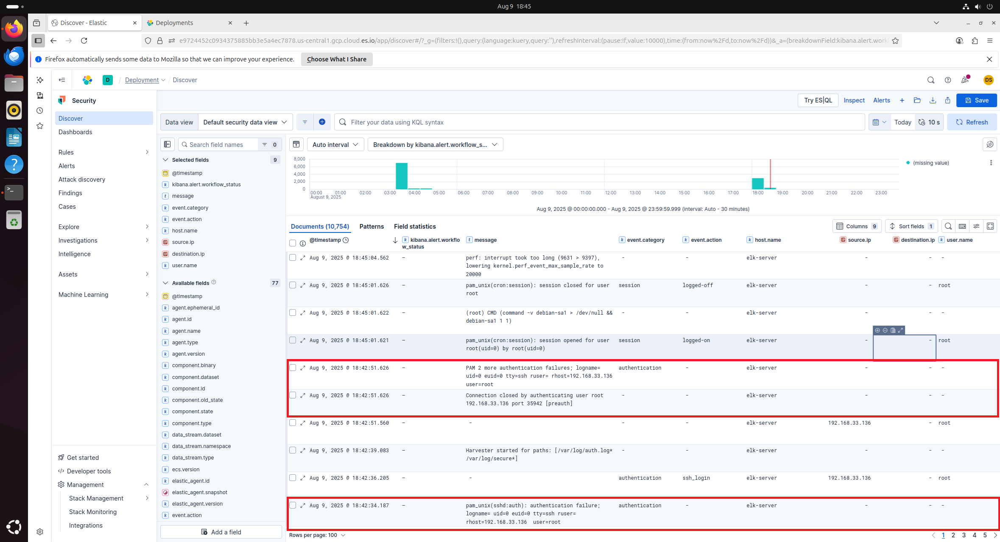

# SIEM (Elastic Stack – Elastic Cloud) Security Monitoring Lab (Work In Progress)

This project demonstrates the setup of a virtual Security Information and Event Management (SIEM) environment using the Elastic Stack (Elasticsearch, Kibana, Fleet, and Elastic Agent) in **Elastic Cloud**, with multiple virtual machines forwarding logs for centralized analysis. It simulates a Security Operations Center (SOC) scenario with real-time log ingestion, detection rules, alerts, and simulated cyberattacks — all in an isolated home lab running in VMware.

---

## Project Overview

The goal of this project is to replicate a real-world SOC monitoring setup. The lab environment includes:
- A **SIEM server** (Ubuntu) running a GUI and Elastic Agent for log collection.
- **Windows and Linux endpoints** sending security telemetry to Elastic Cloud via Fleet.
- A **Kali Linux attacker machine** generating malicious traffic and events.
- **Detection rules** to catch brute force attempts, suspicious processes, and other attack patterns.
- **Webhook-based desktop notifications** for real-time alert popups on the SIEM server.

---

## Table of Contents

- [Project Setup](#project-setup)
- [Architecture Diagram](#architecture-diagram)
- [Network Configuration](#network-configuration)
- [Elastic Stack Installation and Configuration](#elastic-stack-installation-and-configuration)
- [Agent Enrollment and Log Forwarding](#agent-enrollment-and-log-forwarding)
- [Simulated Attacks](#simulated-attacks)
- [Detection and Alerting](#detection-and-alerting)
- [Screenshots](#screenshots)
- [Conclusion](#conclusion)

---

## Project Setup

### Prerequisites

- **VMware Workstation** (or similar hypervisor)
- **Ubuntu Server ISO** (converted to GUI with XFCE desktop)
- **Windows 10 ISO**
- **CentOS Linux ISO**
- **Kali Linux ISO**
- **Elastic Cloud trial account**

### VM Resources

| VM              | vCPU | RAM  | Storage | Role                                    |
|------------------|------|------|---------|-----------------------------------------|
| Ubuntu ELK       | 2–4  | 4–8GB| 50GB    | SIEM agent host + GUI for investigation |
| Windows 10       | 2    | 4GB  | 30GB    | Endpoint with Sysmon + Elastic Agent    |
| CentOS           | 1–2  | 2GB  | 20GB    | Linux log source with Elastic Agent     |
| Kali Linux       | 2    | 2GB  | 30GB    | Attacker for simulated incidents        |

---

## Architecture Diagram


**IP Assignments:**
| VM              | IP Address       |
|------------------|------------------|
| Ubuntu ELK       | 192.168.33.133   |
| CentOS Client    | 192.168.33.134   |
| Windows 10 Client| 192.168.33.135   |
| Kali Linux       | 192.168.33.136   |

All VMs are on an **Internal Network** in VMware for isolation.

---

## Elastic Stack Installation and Configuration

Instead of self-hosting Elasticsearch, Logstash, and Kibana, this lab uses **Elastic Cloud** for scalability and managed hosting.

### Steps
1. **Create Elastic Cloud Deployment**
   - Spin up a cluster and note the **Cloud ID** and **Kibana URL**.

2. **Install GUI on Ubuntu Server**
   ```bash
   sudo apt install ubuntu-desktop
   ```
   This allows direct Kibana access and local alert popups.
3. **Import Prebuilt Detection Rules**
   -  1,400+ built-in Elastic rules for common threats.


---

## Agent Enrollment and Log Forwarding

### Ubuntu ELK Server
- Installed **Elastic Agent** and enrolled it in **Fleet**.
- Enabled **System** integration to forward `/var/log/auth.log`, `/var/log/syslog`, and host metrics.

### Windows 10 Client
- Installed **Sysmon** (SwiftOnSecurity config) for enhanced process logging.
- Installed **Elastic Agent** via Fleet.
- Enabled **Windows** and **Sysmon** integrations for event logs, process creation, and security events.

### CentOS Client
- Installed **Elastic Agent** and enabled:
  - **System** (auth.log, syslog)
  - **Auditd** for command execution and privilege escalation events.

**Fleet UI** confirms all agents are **Healthy** and actively sending logs.

---

## Simulated Attacks

The **Kali Linux** machine is used to generate realistic attack telemetry:
- SSH brute force attempts against the Ubuntu ELK server.
- Unauthorized credential use.
- *(Planned)* Windows RDP brute force.
- *(Planned)* Suspicious PowerShell execution.
- Network scanning with `nmap`.

**Example:**  
SSH brute force attempt from `192.168.33.136` (Kali) to `192.168.33.133` (Ubuntu ELK) produced multiple authentication failures in **Kibana Discover**.

---

## Detection and Alerting

### SSH Brute Force Rule (Threshold)
**KQL Query:**
```kql
event.dataset : "system.auth" and event.outcome : "failure" and event.action : "ssh_login"
```
**Trigger:** ≥ 5 failures from same `source.ip` in 5 minutes.

**Action:** Send to Kibana Security Alerts and trigger webhook.

---

### Webhook → Desktop Alert
Created a webhook that triggers a `notify-send` popup on the Ubuntu GUI:

```bash
#!/bin/bash
# /usr/local/bin/elk-alert-popup.sh
TITLE="SIEM Alert"
MESSAGE="$1"
DISPLAY=:0 DBUS_SESSION_BUS_ADDRESS=unix:path=/run/user/1000/bus notify-send "$TITLE" "$MESSAGE"
```

The webhook calls this script, producing **visible desktop popups** for analyst awareness.

---

## MITRE ATT&CK Mapping

| Detection Scenario                  | MITRE Technique ID | Description                                                         |
|--------------------------------------|--------------------|---------------------------------------------------------------------|
| SSH Brute Force                      | T1110               | Multiple failed SSH logins from the same source.                    |
| Suspicious PowerShell Execution      | T1059.001           | Execution of PowerShell commands with obfuscation or unusual flags. |
| Remote Service Exploitation (SSH)    | T1021.004           | Attempted remote login using SSH with invalid credentials.          |
| Privilege Escalation via Auditd Logs | T1068               | Auditd entries showing potential exploit of privileged process.     |

---

## Screenshots

### GUI Install


### Fleet Agents


### Discover View – SSH Failures


### Alert Fired in Kibana


---

## Conclusion

This project demonstrates:

- Deploying **Elastic Stack** in Elastic Cloud.
- Enrolling and managing endpoints with **Fleet**.
- Using **Sysmon**, **Auditd**, and **System** logs for visibility across OS platforms.
- Building detection rules for SSH brute force and other attacks.
- Triggering **real-time analyst notifications** via webhook popups.
- Mapping detections to **MITRE ATT&CK** techniques.

These workflows replicate real SOC monitoring and incident response, showcasing skills in **SIEM administration, threat detection, and practical security operations**.
